<div align="center">


# Halcyon

**An internal service desk built on an event store.**
Requests to IT, the legal team, marketing, recruitment, finance, HR (Kadry Polska and Kadry Zagranica: Belgia, Niemcy,
Francja) and the legalisation of foreign workers (Legalizacja) go into one pool. An agent takes one, works it, hands it over or gives it
back, and resolves it. Every request has a deadline set by its priority, with warnings while time runs out and alerts
once it is over. Attachments sit in S3, and every change is an event in the ticket's stream.


<br />

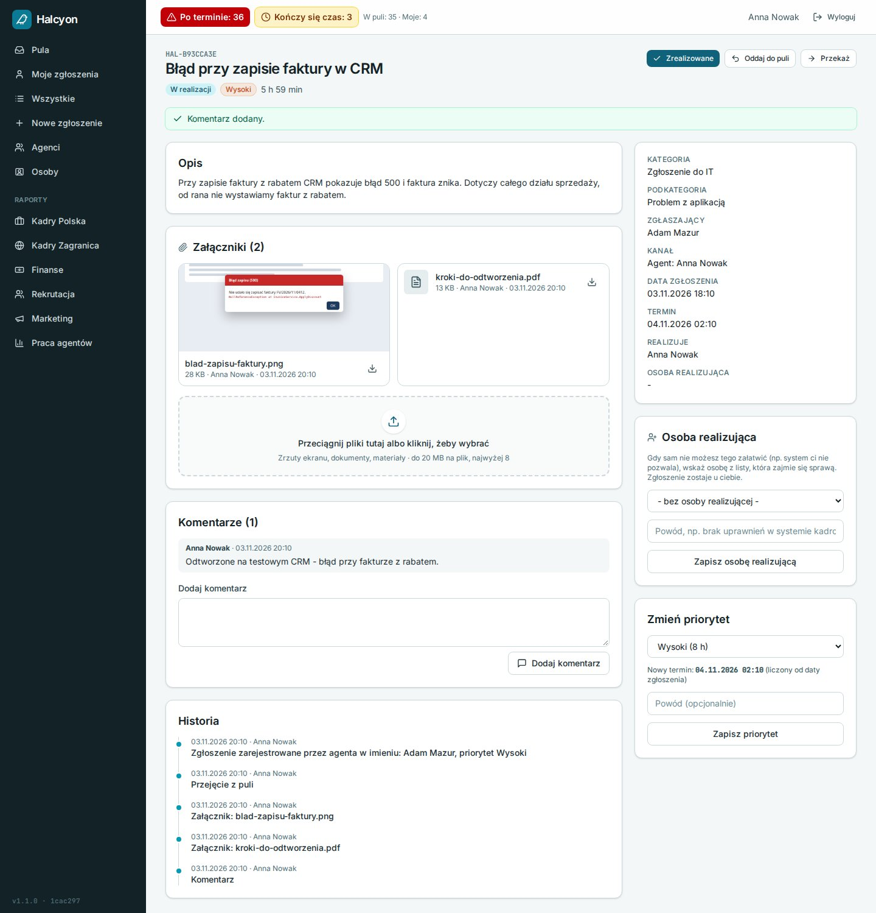

<sub>A ticket in progress: time left, an error screenshot and a PDF in the attachments, a comment, and the timeline read
straight from the event stream. All screens are real, produced by the e2e run, in
<a href="docs/screens/"><code>docs/screens/</code></a>.</sub>

</div>

---

## Why it is interesting

- **A ticket is an event stream** (ADR-0003). `TicketReported`, `TicketTaken`, `TicketHandedOver`,
  `TicketReturnedToPool`, `TicketPriorityChanged`, `TicketResolved`, `TicketCommented`, `TicketAttachmentAdded` and
  `TicketFieldsUpdated`, `TicketHandlerAssigned` are
  stored as facts in Marten, never updated. The timeline on the ticket page is the stream itself.
- **Decide, then fold.** The aggregate is plain C#: decisions such as `Take` or `Resolve` check the rules and return an
  event, and private `On` methods fold events without ever refusing one. Marten folds the stream through the domain's own
  `Evolve`, so the domain project has no Marten dependency.
- **Two agents, one click.** Writes go through `FetchForWriting` with Marten's version check. The slower agent is not
  silently overwritten: they get *"Ktoś był szybszy: zgłoszenie jest teraz w realizacji u: …"*.
- **The read model is consistent right after the click.** `TicketView` is an inline projection written in the same
  transaction as the events, with indexed columns for the lists (status, assignee, deadline, category).
- **Deadlines are calendar time from the report date** (ADR-0004): Critical 3 h, High 8 h, Medium 3 days, Low 1 week
  by default, `Sla__*Hours` per deployment. A priority change moves the deadline from the *report* date. The deadline
  is stored in the event that gives it (ADR-0013), so a changed SLA never moves a ticket already there. The "due soon / overdue" state is computed when read,
  so no background job can be late.
- **Attachments that cannot hurt** (ADR-0008). The bytes go to a private RustFS bucket, and the record is an event. Files
  are stored first and the events saved next; a failed save removes the files again. The type comes from the extension,
  never from what the browser says, and SVG and HTML are refused. Downloads are for agents only, with `nosniff` and a
  `sandbox` CSP.
- **Production-shaped database** (ADR-0002). The schema changes only through `Halcyon.DbMigrator`. A release host
  refuses to start on a database that is behind, and the seed is idempotent by stable key (ADR-0006).
- **Three test levels on real infrastructure** (ADR-0007): domain tests with no I/O, integration tests on PostgreSQL 18
  and RustFS (Testcontainers), and Playwright against the real app process. The screenshots below are produced by that
  e2e run.
- **Report data and exports** (ADR-0009). A topic can collect its own fields (a Limosa number, a new employee's PESEL,
  an invoice amount); they are validated in the domain, stored in the ticket's events and turned into HR, finance and
  agents' reports with XLSX (ClosedXML), PDF (QuestPDF) and CSV exports.
- **The app reports on itself** (ADR-0011). A System menu shows how many answers were 200, 403 or 500, the most
  frequent errors, the application's log, PostgreSQL's sessions and tables, and the in-memory queues. Answers and log
  entries go to the database through a bounded queue and binary COPY, and a background job removes them after 14 days.
- **Charts without a chart library** (ADR-0010). Flow in and out, the backlog, deadlines kept, SLA use per priority, the
  queue now, categories, agents and a weekday × hour heatmap, drawn on the server as SVG and HTML from one query on the
  projection; hover values by CSS alone and the same numbers as a table under each chart.
- **Paged lists, totals on request.** Pages are read in the database (open by deadline, then resolved), the next page
  is known from one extra row, and the total is a separate `COUNT` behind a button; a search finds a title or a number. A number is
  never given twice: a unique index guards it, and a report that meets one is made again (ADR-0014).
- **Polish and English** (ADR-0012). A PL / EN switch on every page; texts sit in both languages where they are used,
  the domain keeps its Polish catalog and refusals and the app translates them for display - stored data never changes.
- **Spec-driven.** Every feature has a spec in `docs/specs/`, and every acceptance criterion names its test.

## Screenshots

The whole portal - a ticket's life step by step, two agents at once, campaigns, every report, the phone - with new
diagrams is in **[`docs/Portal.md`](docs/Portal.md)** (screens in [`docs/screens/portal/`](docs/screens/portal/)).

| | |
|---|---|
| 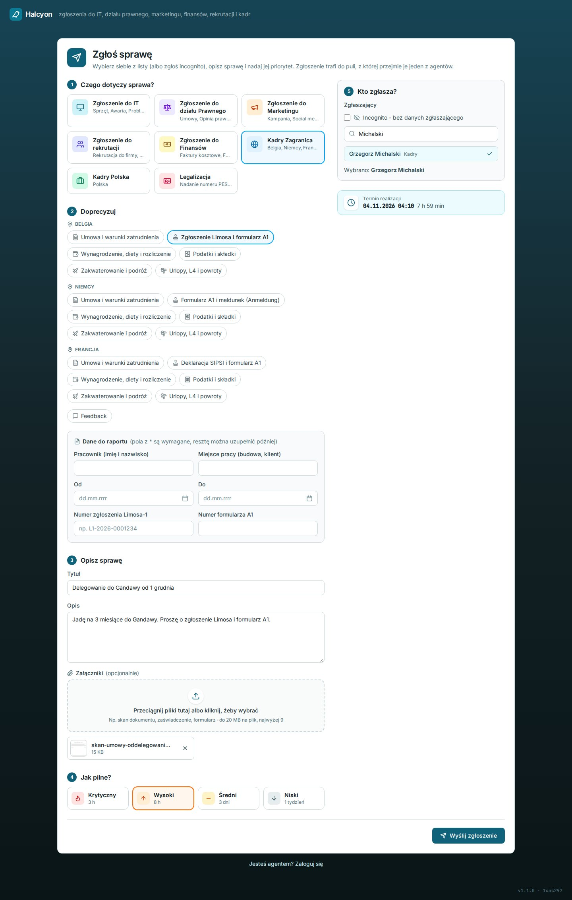 | 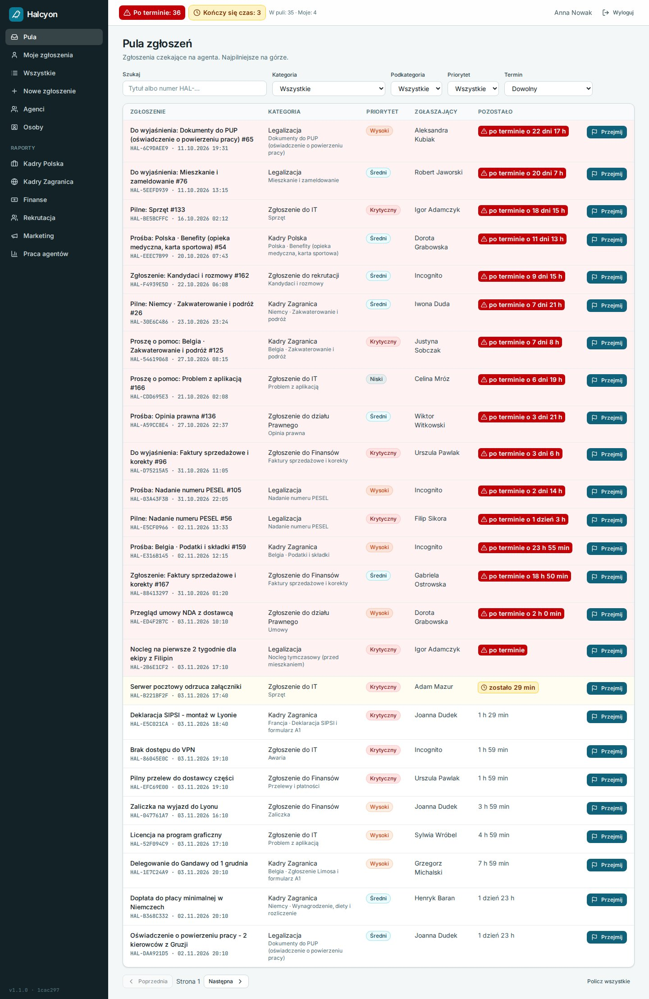 |
| **Public form**: no sign-in. Category tiles, then topics grouped by market (Belgia: Limosa + A1, Niemcy: Anmeldung, Francja: SIPSI), files by drag and drop, priority with its SLA, and the deadline before sending. | **Pool**: the most urgent on top. Overdue rows in red, due soon in amber, counters in the top bar, filters by category, subcategory, priority and deadline. |
| 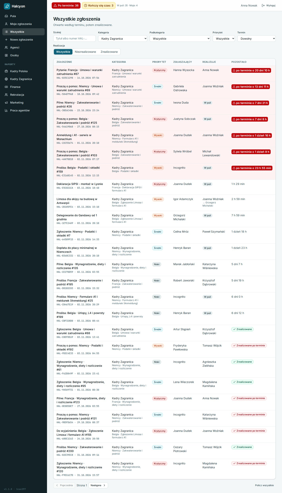 | 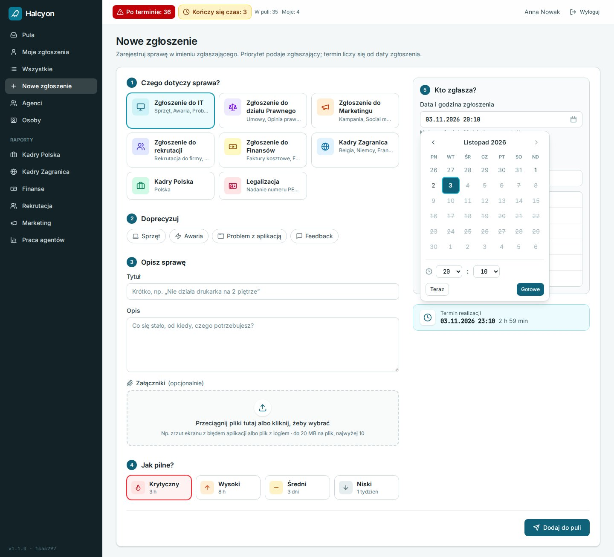 |
| **All tickets**: here filtered to Kadry Zagranica, with the market in front of the topic. | **Agent's report**: a ticket taken by phone or e-mail, backdated up to 30 days with a custom date-time picker. |
| 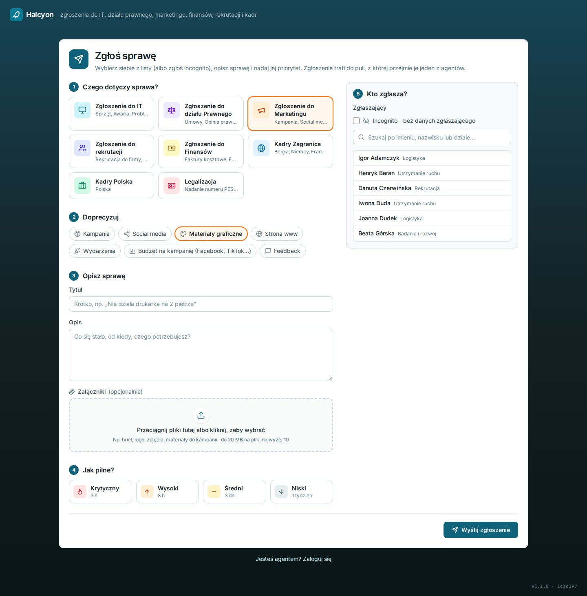 | 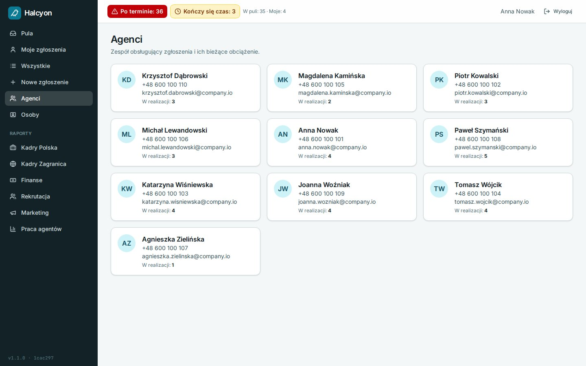 |
| **Marketing**: every team has its own topics and its own hint for attachments (a brief, a logo, photos). | **Agents**: contacts of the team and how many tickets each one has in progress. |
| 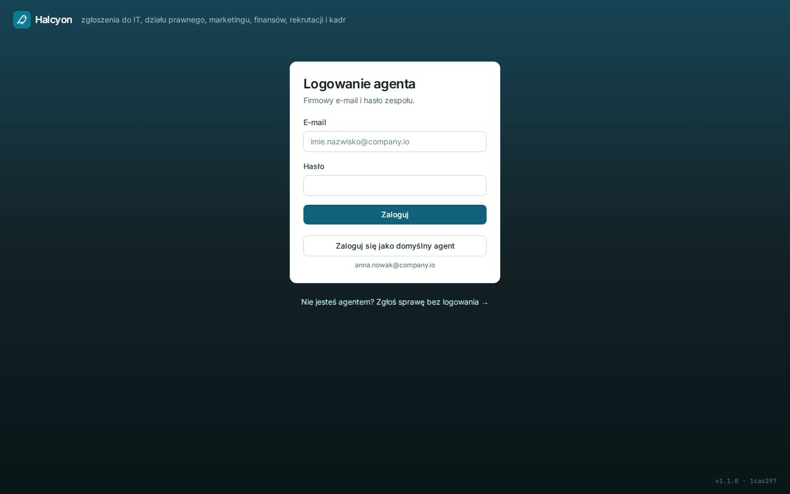 | 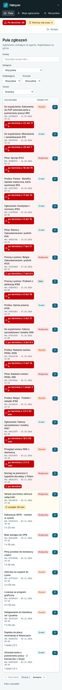 |
| **Sign-in**: e-mail and the team password, or one click as the demo agent. | **Phone**: the same pool, with time left under the title. |
| 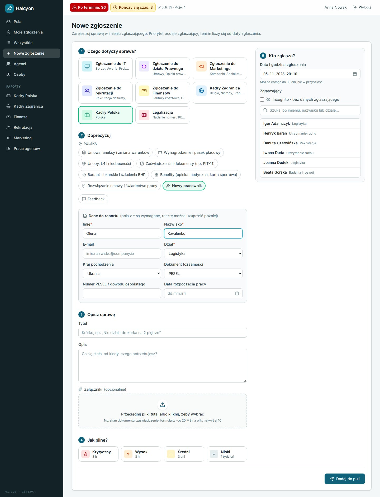 | 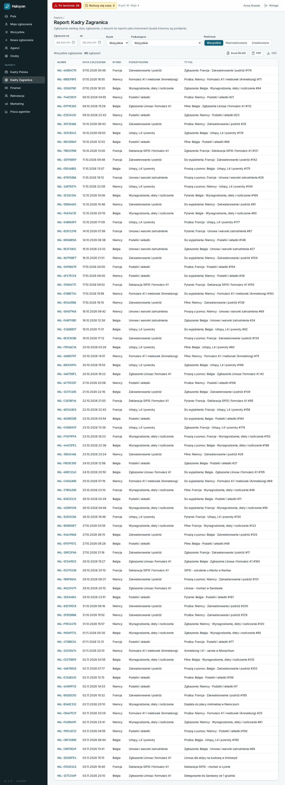 |
| **Report fields**: a new employee in Kadry Polska - name, department, country (favourites first), PESEL checked by its check digit. | **Reports**: Kadry Zagranica with filters (dates, market, topic, open / resolved) and XLSX, PDF and CSV exports. |
| 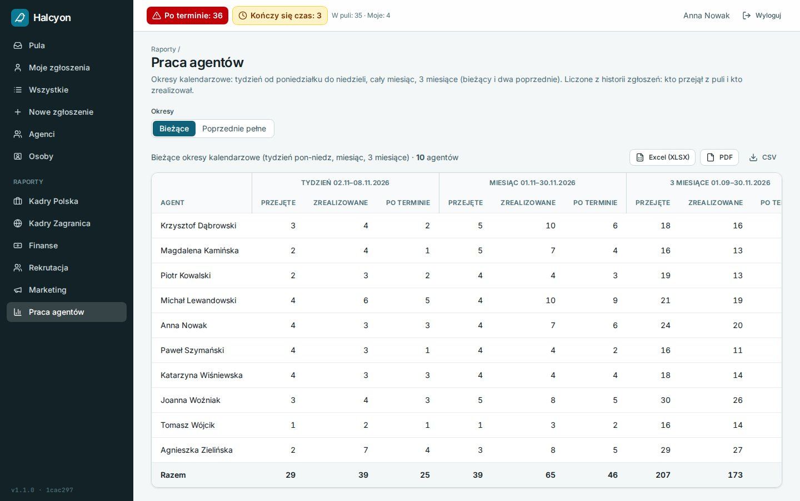 | 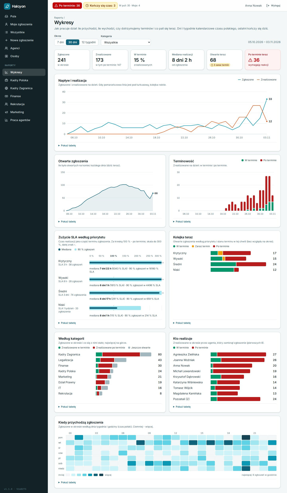 |
| **Agents' work**: taken, resolved and late per agent in the calendar week, month and 3 months. | **Charts**: flow in and out, the backlog, deadlines kept, SLA use per priority, the queue now, by category, by agent and a weekday × hour heatmap - drawn on the server, with hover values and a table under each. |

## Architecture

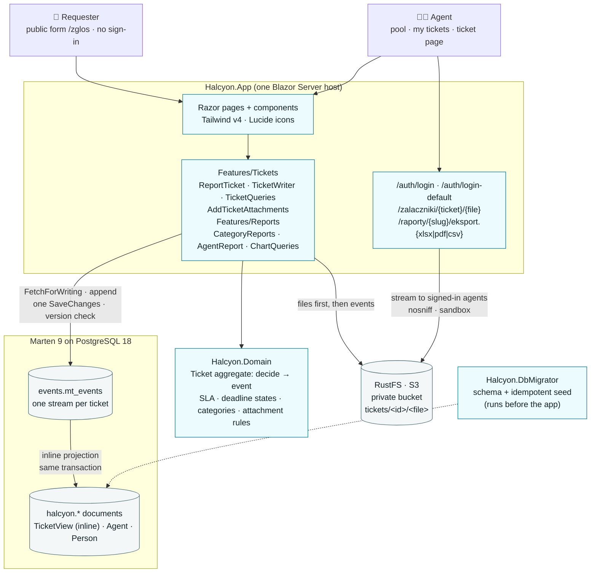
```mermaid
flowchart TB
    requester["🙋 Requester<br/>public form /zglos · no sign-in"]
    agent["🧑‍💻 Agent<br/>pool · my tickets · ticket page"]

    subgraph host["Halcyon.App (one Blazor Server host)"]
        direction LR
        pages["Razor pages + components<br/>Tailwind v4 · Lucide icons"]
        features["Features/Tickets<br/>ReportTicket · TicketWriter · TicketQueries<br/>AddTicketAttachments<br/>Features/Reports<br/>CategoryReports · AgentReport · ChartQueries"]
        endpoints["/auth/login · /auth/login-default<br/>/zalaczniki/{ticket}/{file}<br/>/raporty/{slug}/eksport.{xlsx|pdf|csv}"]
    end

    domain["Halcyon.Domain<br/>Ticket aggregate: decide → event<br/>SLA · deadline states · categories · attachment rules"]

    subgraph marten["Marten 9 on PostgreSQL 18"]
        direction LR
        events[("events.mt_events<br/>one stream per ticket")]
        docs[("halcyon.* documents<br/>TicketView (inline) · Agent · Person")]
    end

    s3[("RustFS · S3<br/>private bucket<br/>tickets/&lt;id&gt;/&lt;file&gt;")]
    migrator["Halcyon.DbMigrator<br/>schema + idempotent seed<br/>(runs before the app)"]

    requester & agent --> pages
    pages --> features
    agent --> endpoints
    features --> domain
    features -- "FetchForWriting · append<br/>one SaveChanges · version check" --> events
    events -- "inline projection<br/>same transaction" --> docs
    features -- "files first, then events" --> s3
    endpoints -- "stream to signed-in agents<br/>nosniff · sandbox" --> s3
    migrator -.-> docs

    classDef proc fill:#ecfbfd,stroke:#0b7a95,color:#132226
    classDef store fill:#f4f7f8,stroke:#4f6e77,color:#132226
    class pages,features,endpoints,domain,migrator proc
    class events,docs,s3 store
```

The pages inject the feature classes directly, with no HTTP calls to their own host. The sign-in form, the attachment
download and the report exports are the only plain HTTP endpoints: a circuit cannot write a cookie or stream a file.

### A ticket's life

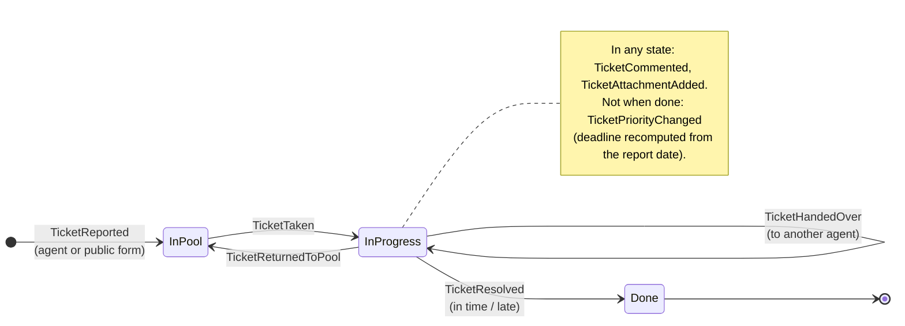
```mermaid
stateDiagram-v2
    direction LR
    [*] --> InPool: TicketReported<br/>(agent or public form)
    InPool --> InProgress: TicketTaken
    InProgress --> InProgress: TicketHandedOver<br/>(to another agent)
    InProgress --> InPool: TicketReturnedToPool
    InProgress --> Done: TicketResolved<br/>(in time / late)
    Done --> [*]
    note right of InProgress
        In any state: TicketCommented, TicketAttachmentAdded.
        Not when done: TicketPriorityChanged
        (deadline recomputed from the report date).
    end note
```

### One click, one event: the write path

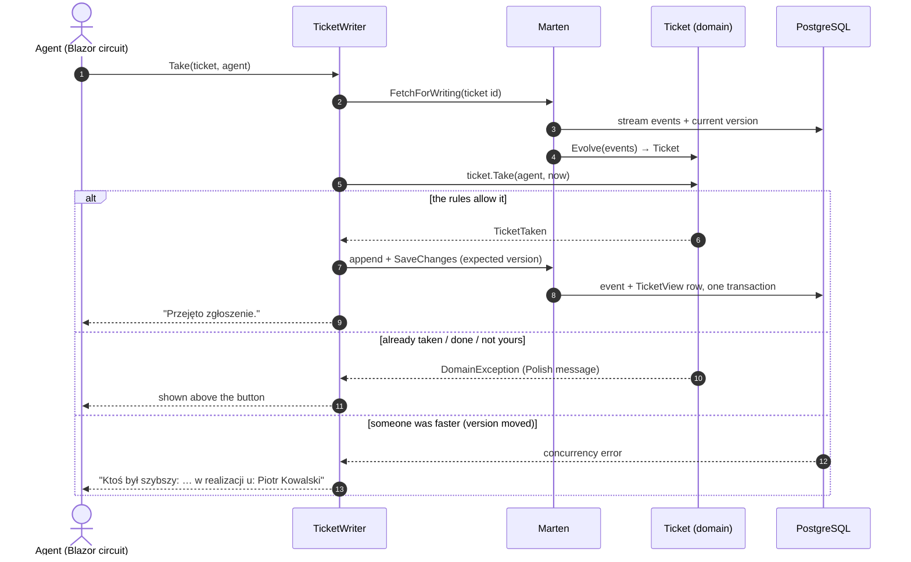
```mermaid
sequenceDiagram
    autonumber
    actor A as Agent (Blazor circuit)
    participant W as TicketWriter
    participant M as Marten
    participant T as Ticket (domain)
    participant DB as PostgreSQL

    A->>W: Take(ticket, agent)
    W->>M: FetchForWriting(ticket id)
    M->>DB: stream events + current version
    M->>T: Evolve(events) → Ticket
    W->>T: ticket.Take(agent, now)
    alt the rules allow it
        T-->>W: TicketTaken
        W->>M: append + SaveChanges (expected version)
        M->>DB: event + TicketView row, one transaction
        W-->>A: "Przejęto zgłoszenie."
    else already taken / done / not yours
        T-->>W: DomainException (Polish message)
        W-->>A: shown above the button
    else someone was faster (version moved)
        DB-->>W: concurrency error
        W-->>A: "Ktoś był szybszy: … w realizacji u: Piotr Kowalski"
    end
```

### Attachments: S3 first, events second

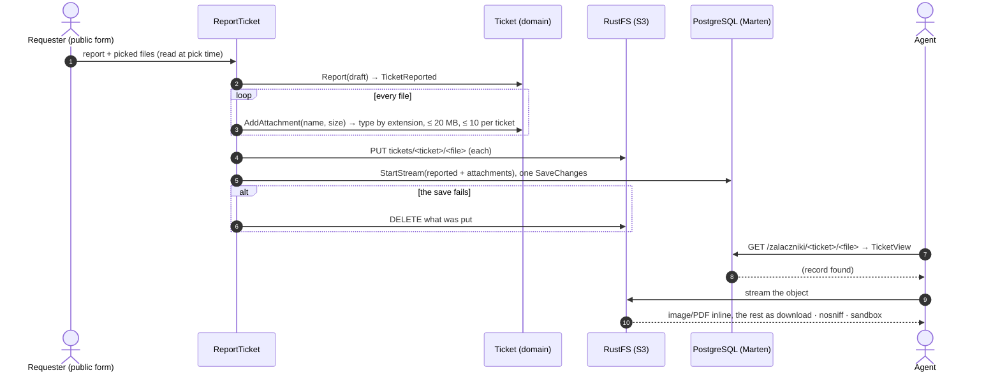
```mermaid
sequenceDiagram
    autonumber
    actor R as Requester (public form)
    participant F as ReportTicket
    participant T as Ticket (domain)
    participant S as RustFS (S3)
    participant DB as PostgreSQL (Marten)
    actor A as Agent

    R->>F: report + picked files (read at pick time)
    F->>T: Report(draft) → TicketReported
    loop every file
        F->>T: AddAttachment(name, size) → type by extension, ≤ 20 MB, ≤ 10 per ticket
    end
    F->>S: PUT tickets/<ticket>/<file> (each)
    F->>DB: StartStream(reported + attachments), one SaveChanges
    alt the save fails
        F->>S: DELETE what was put
    end
    A->>DB: GET /zalaczniki/<ticket>/<file> → TicketView
    DB-->>A: (record found)
    A->>S: stream the object
    S-->>A: image/PDF inline, the rest as download · nosniff · sandbox
```

### Deadlines and alerts

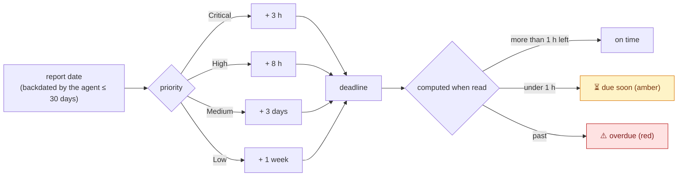
```mermaid
flowchart LR
    reported["report date<br/>(backdated by the agent ≤ 30 days)"] --> sla{"priority"}
    sla -- "Critical" --> c["+ 3 h"]
    sla -- "High" --> h["+ 8 h"]
    sla -- "Medium" --> m["+ 3 days"]
    sla -- "Low" --> l["+ 1 week"]
    c & h & m & l --> deadline["deadline"]
    deadline --> state{"computed when read"}
    state -- "more than 1 h left" --> ontime["on time"]
    state -- "under 1 h" --> soon["⏳ due soon (amber)"]
    state -- "past" --> over["⚠️ overdue (red)"]

    classDef warn fill:#fef3c7,stroke:#d97706,color:#78350f
    classDef bad fill:#fee2e2,stroke:#b91c1c,color:#7f1d1d
    class soon warn
    class over bad
```

### Categories

Categories are code (ADR-0003): stable keys are stored on tickets, and the names are only for display. A subcategory
can carry a group, its market, which the form shows as a heading and the lists show as "Belgia · …". It can also list
report fields (spec 008): text, date, e-mail, choice, amount or IBAN, checked by the domain and shown as report columns.

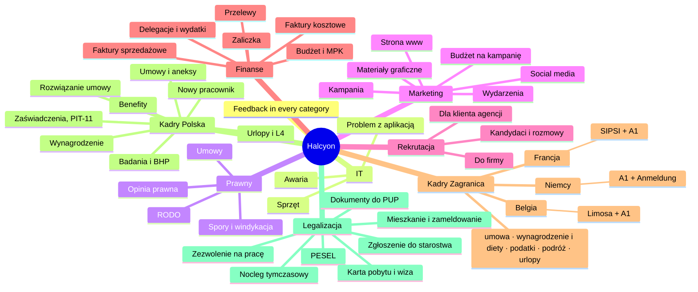
```mermaid
mindmap
  root((Halcyon))
    Feedback in every category
    IT
      Sprzęt
      Awaria
      Problem z aplikacją
    Prawny
      Umowy
      Opinia prawna
      RODO
      Spory i windykacja
    Marketing
      Kampania
      Social media
      Materiały graficzne
      Strona www
      Wydarzenia
      Budżet na kampanię
    Rekrutacja
      Do firmy
      Dla klienta agencji
      Kandydaci i rozmowy
    Finanse
      Faktury kosztowe
      Faktury sprzedażowe
      Delegacje i wydatki
      Zaliczka
      Przelewy
      Budżet i MPK
    Kadry Zagranica
      Belgia
        Limosa + A1
      Niemcy
        A1 + Anmeldung
      Francja
        SIPSI + A1
      umowa · wynagrodzenie i diety · podatki · podróż · urlopy
    Kadry Polska
      Umowy i aneksy
      Wynagrodzenie
      Urlopy i L4
      Zaświadczenia, PIT-11
      Badania i BHP
      Benefity
      Rozwiązanie umowy
      Nowy pracownik
    Legalizacja
      PESEL
      Nocleg tymczasowy
      Mieszkanie i zameldowanie
      Dokumenty do PUP
      Zgłoszenie do starostwa
      Zezwolenie na pracę
      Karta pobytu i wiza
```

### The local stack

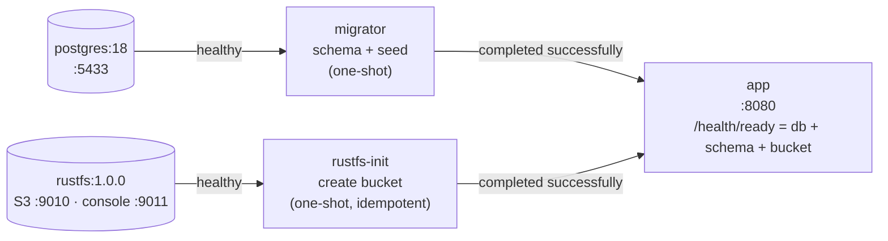
```mermaid
flowchart LR
    pg[("postgres:18<br/>:5433")] -- healthy --> mig["migrator<br/>schema + seed<br/>(one-shot)"]
    rfs[("rustfs:1.0.0<br/>S3 :9010 · console :9011")] -- healthy --> init["rustfs-init<br/>create bucket<br/>(one-shot, idempotent)"]
    mig -- "completed successfully" --> app["app<br/>:8080<br/>/health/ready = db + schema + bucket"]
    init -- "completed successfully" --> app
```

## Stack

| Area | Choice |
|---|---|
| Host & UI | .NET 10, ASP.NET Core, Blazor interactive server (no prerender), Tailwind CSS v4 (output committed), Lucide icons inline, custom date-time picker |
| Data | Marten 9.57 on PostgreSQL 18: event store (one stream per ticket, quick append), documents, inline `TicketView` projection, `System.Text.Json` with enums as strings |
| Reports | ClosedXML 0.105 (XLSX, MIT), QuestPDF 2026.9 (PDF, Community licence - free below USD 1M annual revenue, ADR-0009), CSV for a Polish Excel |
| Files | RustFS (S3 API) via AWSSDK.S3 4 (path style, checksums only when required), private bucket, a one-shot init container |
| Auth | Cookie session (sliding 8 h), one shared team password from the environment (demo, ADR-0005), rate-limited sign-in, one-click demo agent |
| Ops | `/health` and `/health/ready`, version + git commit in the sidebar and the start log (`GIT_SHA` build argument from `up.sh`), Serilog (one line per request), docker compose with healthchecks and one-shot init containers, `up.sh` / `down.sh` / `logs.sh` |
| Quality | xUnit v3, Shouldly, Testcontainers (PostgreSQL 18, RustFS), Playwright (Chromium), CSharpier, Husky.Net, `TreatWarningsAsErrors` + `latest-recommended` analyzers |

## Repository

```text
src/Halcyon.Domain/          Ticket aggregate + events, SLA, deadline states, categories, attachment rules - plain C#
src/Halcyon.Database/        HalcyonStore (the store described once), documents, projections, migrations, idempotent seed
src/Halcyon.App/             the host: Components/ (pages, UI), Features/<Area>/, Auth/, Storage/ (S3)
src/Halcyon.DbMigrator/      apply / --dry-run / seed, exit code 0 or 1
tests/Halcyon.Domain.Tests/  rules only, no I/O
tests/Halcyon.IntegrationTests/  features, host, migrator and seed on PostgreSQL 18; S3 against RustFS
tests/Halcyon.E2E/           Playwright against the real app process (own PostgreSQL + RustFS), screenshots + portal tour
deploy/rustfs/               the bucket init script
docs/adr/  docs/specs/done/  decisions 0001-0014, specs 001-012 (each criterion names its test)
docs/Portal.md               the portal in screenshots, with diagrams; docs/screens/ holds the images
```

## Run locally

Needs the .NET SDK 10 and Docker.

```bash
./up.sh            # builds and starts postgres, rustfs (+ bucket), the migrator (schema + seed) and the app
./logs.sh app      # follow logs (all services without arguments; TAIL=500 for more history)
./down.sh          # stop; data stays (--purge drops the volumes, the next ./up.sh seeds from scratch)
```

`./up.sh` creates `.env` from `.env-sample` on the first run, waits until the app is healthy and prints every address:

| What | Where |
|---|---|
| App | http://localhost:8080 - click **"Zaloguj się jako domyślny agent"**, or sign in as any agent (e.g. `anna.nowak@company.io`) with `AGENT_PASSWORD` |
| Public form | http://localhost:8080/zglos - requesters report without signing in |
| RustFS console | http://localhost:9011/rustfs/console/ - `S3_ACCESS_KEY` / `S3_SECRET_KEY` |
| PostgreSQL | `localhost:5433` - `halcyon` / `POSTGRES_PASSWORD` |

The seed has 10 agents, 40 people (10 of them recruiters), 38 hand-written tickets across every team - many with report
data - and 200 generated ones for the paged lists, in every state: in the pool, in progress, handed
over, done in time and late, and close to or past the deadline.

With `dotnet run` against the same containers:

```bash
docker compose up -d                # postgres + rustfs + bucket init only
dotnet run --project src/Halcyon.DbMigrator -- seed --ConnectionStrings:Postgres="Host=localhost;Port=5433;Database=halcyon;Username=halcyon;Password=<POSTGRES_PASSWORD>"
dotnet user-secrets --project src/Halcyon.App set "ConnectionStrings:Postgres" "Host=localhost;Port=5433;Database=halcyon;Username=halcyon;Password=<POSTGRES_PASSWORD>"
dotnet user-secrets --project src/Halcyon.App set "Auth:AgentPassword" "<AGENT_PASSWORD>"
dotnet user-secrets --project src/Halcyon.App set "Storage:AccessKey" "<S3_ACCESS_KEY>"
dotnet user-secrets --project src/Halcyon.App set "Storage:SecretKey" "<S3_SECRET_KEY>"
dotnet run --project src/Halcyon.App
```

Styles: run `cd src/Halcyon.App && npm install` once. After that the build regenerates `wwwroot/css/app.css` whenever
markup or styles change. The file is committed, and the images use it as it is.

## Tests

```bash
scripts/test.sh              # domain + integration
scripts/test.sh e2e          # browser tests (installs Chromium on the first run; HEADED=1 to watch)
scripts/test.sh all          # all three levels
scripts/screens.sh           # regenerate docs/screens/*.jpg and docs/screens/portal/*.jpg from the e2e run
dotnet csharpier check .
```

Integration and e2e tests need Docker. The e2e run writes `halcyon-app.log` and `screens/**/*.jpg` next to its output
(`tests/Halcyon.E2E/bin/Debug/net10.0/`).

## Configuration

Everything comes from the environment; required values make the host refuse to start with a clear reason.

| Variable | Default | |
|---|---|---|
| `ConnectionStrings__Postgres` | - | required |
| `Auth__AgentPassword` | - | required, the team's shared password |
| `Auth__DefaultAgentEmail` | empty | demo one-click sign-in; empty hides the button |
| `Auth__SessionHours` / `Auth__SignInAttemptsPerMinute` | 8 / 10 | |
| `Storage__ServiceUrl` / `__AccessKey` / `__SecretKey` | - | required, the S3 endpoint and keys |
| `Storage__Bucket` / `Storage__Region` | `halcyon-attachments` / `us-east-1` | |
| `Sla__CriticalHours` / `__HighHours` / `__MediumHours` / `__LowHours` | 3 / 8 / 72 / 168 | SLA windows (ADR-0013); positive, Critical <= High <= Medium <= Low, else the host refuses to start |
| `Database__ApplyChangesOnStartup` | Development only | a release host checks the schema and refuses a stale one |
| `Monitoring__Retention` | `14.00:00:00` | how long HTTP answers and log entries stay in the database (ADR-0011) |
| `Monitoring__CleanupInterval` / `__CleanupBatchSize` | `01:00:00` / 5000 | how often the cleanup runs, rows per DELETE |
| `Monitoring__FlushInterval` / `__WriteBatchSize` / `__QueueCapacity` | `00:00:02` / 500 / 10000 | the in-memory queues and their writer |
| `Monitoring__LogLevel` | `Information` | the lowest log level kept in the database (the console keeps its own levels) |
| `Monitoring__IgnoredPaths__0..N` | `/health`, `/_blazor`, `/_framework`, `/_content`, `/css`, `/favicon` | path prefixes not recorded; entries from the environment are added to the defaults |

Log levels are set in the `Serilog` section (`Serilog__MinimumLevel__Override__<category>`); `Logging__LogLevel__*` does
nothing.

## Documentation

| Document | What is in it |
|---|---|
| [`docs/adr/`](docs/adr/) | 0001 one host + migrator · 0002 Marten in production mode · 0003 ticket as an event stream · 0004 deadlines and alerts · 0005 simple sign-in · 0006 idempotent seed · 0007 three test levels · 0008 attachments in S3 · 0009 report fields and exports · 0010 charts drawn on the server · 0011 HTTP answers and the log in the database |
| [`docs/specs/`](docs/specs/) | 001 agents and sign-in · 002 reporting · 003 pool and work · 004 deadlines and alerts · 005 comments and timeline · 006 date-time picker · 007 database and seed · 008 report fields and reports · 009 charts · 010 system: status, logs, database, queues |
| [`docs/Portal.md`](docs/Portal.md) | the whole portal in e2e screenshots, with diagrams: the map of pages, a ticket's life, the conflict of two agents, campaigns, reports and charts, how the screens are made |

## Status

A demo, not a production system. The shared team password and "pick yourself from the list" on the public form are
deliberate simplifications (ADR-0005). Possible next steps: notifications by e-mail, per-agent accounts, and a retention
rule for attachments of tickets closed long ago.

## License

MIT - see [LICENSE](LICENSE). The PDF export uses QuestPDF under its Community licence, which is free for organisations
below USD 1M annual revenue; a larger company needs a QuestPDF Professional or Enterprise licence (ADR-0009).
